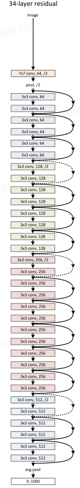
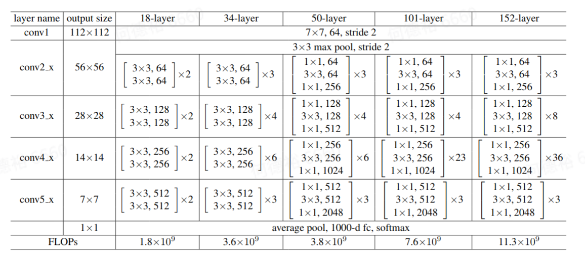
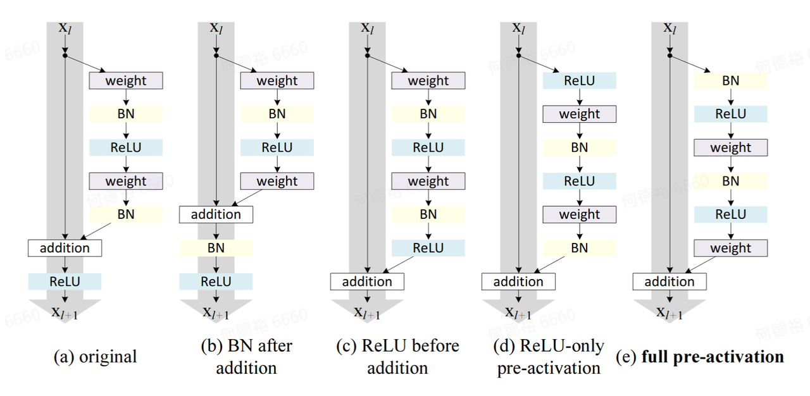
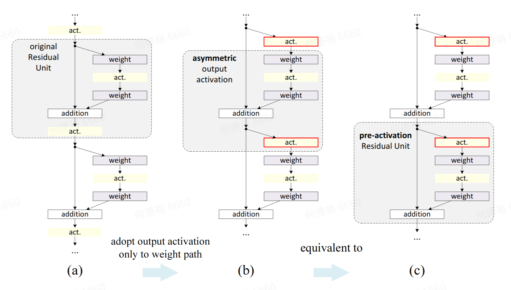
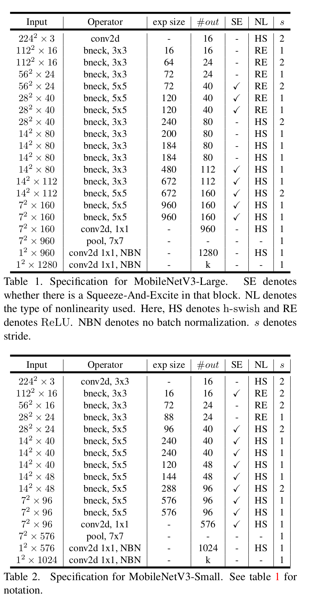

# `Batch Normalization`

以`mmcv`的实现为例。一如既往，注册组件NORM_LAYERS

```python
from .registry import NORM_LAYERS

NORM_LAYERS.register_module('BN', module=nn.BatchNorm2d)
NORM_LAYERS.register_module('BN1d', module=nn.BatchNorm1d)
NORM_LAYERS.register_module('BN2d', module=nn.BatchNorm2d)
NORM_LAYERS.register_module('BN3d', module=nn.BatchNorm3d)
NORM_LAYERS.register_module('SyncBN', module=SyncBatchNorm)
NORM_LAYERS.register_module('GN', module=nn.GroupNorm)
NORM_LAYERS.register_module('LN', module=nn.LayerNorm)
NORM_LAYERS.register_module('IN', module=nn.InstanceNorm2d)
NORM_LAYERS.register_module('IN1d', module=nn.InstanceNorm1d)
NORM_LAYERS.register_module('IN2d', module=nn.InstanceNorm2d)
NORM_LAYERS.register_module('IN3d', module=nn.InstanceNorm3d)
```

NORM_LAYERS注册类的build_from_cfg控制逻辑，对常见的BN2d来说，核心语句就是

layer = norm_layer(num_features, **cfg_)

其中norm_layer为nn.BatchNorm2d。

```python
def build_norm_layer(cfg, num_features, postfix=''):
    if not isinstance(cfg, dict):
        raise TypeError('cfg must be a dict')
    if 'type' not in cfg:
        raise KeyError('the cfg dict must contain the key "type"')
    cfg_ = cfg.copy()

    layer_type = cfg_.pop('type')
    if layer_type not in NORM_LAYERS:
        raise KeyError(f'Unrecognized norm type {layer_type}')

    norm_layer = NORM_LAYERS.get(layer_type)
    abbr = infer_abbr(norm_layer)

    assert isinstance(postfix, (int, str))
    name = abbr + str(postfix)

    requires_grad = cfg_.pop('requires_grad', True)
    cfg_.setdefault('eps', 1e-5)
    if layer_type != 'GN':
        layer = norm_layer(num_features, **cfg_)
        if layer_type == 'SyncBN' and hasattr(layer, '_specify_ddp_gpu_num'):
            layer._specify_ddp_gpu_num(1)
    else:
        assert 'num_groups' in cfg_
        layer = norm_layer(num_channels=num_features, **cfg_)

    for param in layer.parameters():
        param.requires_grad = requires_grad

    return name, layer
```


# `ResNet`系列

## 论文要点

`ResNet-34`：





网络的`stem`是一个`kernel size=7x7`，`stride=2`，`padding=3`的卷积，输出通道数是64，再通过`BN`与`ReLU`。

接下来（默认）通过4个`stage`（上图中同一个`stage`的操作有同一种底色），每个`stage`由若干个残差结构`block`构成，每个`stage`的第一个`block`会进行宽高减半同时通道数翻倍的操作（上图中这些`block`的直通分支用虚线表示其需要进行相应的下采样操作），第一个`stage`使用了`stride=2`的`avg pooling`实现，后边的`stage`使用`stride=2`的卷积实现。`ResNet-34`由4个`stage`组成，分别由3、4、6、3个`block`组成。

`Block`有两种，较浅的模型`ResNet-18`与`ResNet-34`使用`BasicBlock`，`ResNet-50`，`ResNet-101`，`ResNet-152`使用`Bottleneck`。在`ResNet`模型实现中首先通过`ResNet`的层数确定使用何种`Block`以及每个`stage`中`block`的数量，再依次构建`block`与`stage`，每一个`stage`的第一个`block`单独处理下采样的问题，再循环生成余下的`block`。






`ResNet v2`论文对比了不同的`BN`与`ReLU`的位置带来的影响。注意，代码中实现的是最原始的结构，即


## `pytorch`实现

以`mmclassification`的实现为例

首先定义了两种`Block`

`BasicBlock`

```python
class BasicBlock(BaseModule):  # 直筒等尺寸
    def __init__(self,
                 in_channels,
                 out_channels,
                 expansion=1,
                 stride=1,
                 dilation=1,
                 downsample=None,
                 style='pytorch',
                 with_cp=False,
                 conv_cfg=None,
                 norm_cfg=dict(type='BN'),
                 drop_path_rate=0.0,
                 init_cfg=None):
        super(BasicBlock, self).__init__(init_cfg=init_cfg)
        self.in_channels = in_channels
        self.out_channels = out_channels
        self.expansion = expansion
        assert self.expansion == 1  # 对于BasicBlock，expansion等于1
        assert out_channels % expansion == 0
        self.mid_channels = out_channels // expansion
        self.stride = stride
        self.dilation = dilation
        self.style = style
        self.with_cp = with_cp
        self.conv_cfg = conv_cfg
        self.norm_cfg = norm_cfg

        self.norm1_name, norm1 = build_norm_layer(
            norm_cfg, self.mid_channels, postfix=1)
        self.norm2_name, norm2 = build_norm_layer(
            norm_cfg, out_channels, postfix=2)

        self.conv1 = build_conv_layer(
            conv_cfg,
            in_channels,
            self.mid_channels,
            3,
            stride=stride,
            padding=dilation,
            dilation=dilation,
            bias=False)
        self.add_module(self.norm1_name, norm1)
        self.conv2 = build_conv_layer(
            conv_cfg,
            self.mid_channels,
            out_channels,
            3,
            padding=1,
            bias=False)
        self.add_module(self.norm2_name, norm2)

        self.relu = nn.ReLU(inplace=True)
        self.downsample = downsample
        self.drop_path = DropPath(drop_prob=drop_path_rate
                                  ) if drop_path_rate > eps else nn.Identity()
    
    @property
    def norm1(self):
        return getattr(self, self.norm1_name)

    @property
    def norm2(self):
        return getattr(self, self.norm2_name)
    
    def forward(self, x):
        def _inner_forward(x):
            identity = x
			# conv1 -> BN1 -> ReLU -> conv2 -> BN2
            out = self.conv1(x)
            out = self.norm1(out)
            out = self.relu(out)

            out = self.conv2(out)
            out = self.norm2(out)
			# if the current block is 1st in the concerned stage other than 1st stage, downsample needed.
            if self.downsample is not None:
                identity = self.downsample(x)

            out = self.drop_path(out)

            out += identity

            return out

        if self.with_cp and x.requires_grad:
            out = cp.checkpoint(_inner_forward, x)
        else:
            out = _inner_forward(x)
		# final ReLU
        out = self.relu(out)

        return out
```


`Bottleneck`

```python
class Bottleneck(BaseModule):
    def __init__(self,
                 in_channels,
                 out_channels,
                 expansion=4,
                 stride=1,
                 dilation=1,
                 downsample=None,
                 style='pytorch',
                 with_cp=False,
                 conv_cfg=None,
                 norm_cfg=dict(type='BN'),
                 drop_path_rate=0.0,
                 init_cfg=None):
        super(Bottleneck, self).__init__(init_cfg=init_cfg)
        assert style in ['pytorch', 'caffe']

        self.in_channels = in_channels
        self.out_channels = out_channels
        self.expansion = expansion
        assert out_channels % expansion == 0
        self.mid_channels = out_channels // expansion
        self.stride = stride
        self.dilation = dilation
        self.style = style
        self.with_cp = with_cp
        self.conv_cfg = conv_cfg
        self.norm_cfg = norm_cfg

        if self.style == 'pytorch':
            self.conv1_stride = 1
            self.conv2_stride = stride
        else:
            self.conv1_stride = stride
            self.conv2_stride = 1

        self.norm1_name, norm1 = build_norm_layer(
            norm_cfg, self.mid_channels, postfix=1)
        self.norm2_name, norm2 = build_norm_layer(
            norm_cfg, self.mid_channels, postfix=2)
        self.norm3_name, norm3 = build_norm_layer(
            norm_cfg, out_channels, postfix=3)

        self.conv1 = build_conv_layer(
            conv_cfg,
            in_channels,
            self.mid_channels,
            kernel_size=1,
            stride=self.conv1_stride,
            bias=False)
        self.add_module(self.norm1_name, norm1)
        self.conv2 = build_conv_layer(
            conv_cfg,
            self.mid_channels,
            self.mid_channels,
            kernel_size=3,
            stride=self.conv2_stride,
            padding=dilation,
            dilation=dilation,
            bias=False)

        self.add_module(self.norm2_name, norm2)
        self.conv3 = build_conv_layer(
            conv_cfg,
            self.mid_channels,
            out_channels,
            kernel_size=1,
            bias=False)
        self.add_module(self.norm3_name, norm3)

        self.relu = nn.ReLU(inplace=True)
        self.downsample = downsample
        self.drop_path = DropPath(drop_prob=drop_path_rate
                                  ) if drop_path_rate > eps else nn.Identity()

    @property
    def norm1(self):
        return getattr(self, self.norm1_name)

    @property
    def norm2(self):
        return getattr(self, self.norm2_name)

    @property
    def norm3(self):
        return getattr(self, self.norm3_name)

    def forward(self, x):

        def _inner_forward(x):
            identity = x
			# conv1 -> BN1 -> ReLU -> conv2 -> BN2 -> ReLU -> conv3 -> BN3
            out = self.conv1(x)
            out = self.norm1(out)
            out = self.relu(out)

            out = self.conv2(out)
            out = self.norm2(out)
            out = self.relu(out)

            out = self.conv3(out)
            out = self.norm3(out)

            if self.downsample is not None:
                identity = self.downsample(x)

            out = self.drop_path(out)

            out += identity

            return out

        if self.with_cp and x.requires_grad:
            out = cp.checkpoint(_inner_forward, x)
        else:
            out = _inner_forward(x)
		# final ReLU
        out = self.relu(out)

        return out
```


基于`Block`类定义`Stage`

```python
class ResLayer(nn.Sequential):
    def __init__(self,
                 block,
                 num_blocks,
                 in_channels,
                 out_channels,
                 expansion=None,
                 stride=1,
                 avg_down=False,
                 conv_cfg=None,
                 norm_cfg=dict(type='BN'),
                 **kwargs):
        self.block = block
        # 1 for BasicBlock, 4 for Bottleneck
        self.expansion = get_expansion(block, expansion)  

        downsample = None
        # deal with 1st block in each stage to downsample (define the conv, optionally the avg pooling)
        if stride != 1 or in_channels != out_channels:
            downsample = []
            conv_stride = stride
            # if used avg pooling to downsample
            if avg_down and stride != 1:
                conv_stride = 1
                downsample.append(
                    nn.AvgPool2d(
                        kernel_size=stride,
                        stride=stride,
                        ceil_mode=True,
                        count_include_pad=False))
            # used avg pooling conv_stride = 1, otherwise conv_stride should be 2
            downsample.extend([
                build_conv_layer(
                    conv_cfg,
                    in_channels,
                    out_channels,
                    kernel_size=1,
                    stride=conv_stride,
                    bias=False),
                build_norm_layer(norm_cfg, out_channels)[1]
            ])
            downsample = nn.Sequential(*downsample)

        layers = []
        layers.append(
            block(
                in_channels=in_channels,
                out_channels=out_channels,
                expansion=self.expansion, # 1 for BasicBlock, 4 for Bottleneck
                stride=stride,
                downsample=downsample, # difined above
                conv_cfg=conv_cfg,
                norm_cfg=norm_cfg,
                **kwargs))
        in_channels = out_channels # downsample done
        # other blocks in the current stage, downsample = None
        for i in range(1, num_blocks):
            layers.append(
                block(
                    in_channels=in_channels,
                    out_channels=out_channels,
                    expansion=self.expansion,
                    stride=1,
                    conv_cfg=conv_cfg,
                    norm_cfg=norm_cfg,
                    **kwargs))
        super(ResLayer, self).__init__(*layers)
```


`ResNet`类首先定义好了各个`ResNet`使用的`Block`类型与每个`Stage`的`Block`数量。


# `ShuffleNet`系列

## 论文要点

参考`shufflenet v1`总结与`shufflenet v2`总结

## `pytorch`实现

以`mmclassification`的实现为例，先定义残差`block`，兼容`stride=1`与`stride=2`两种情况，后者表示经过该`block`后宽高减半，通道数翻倍。结合论文要点，注意`depthwise conv3x3 + BN`后不接`ReLU`。

```python
class InvertedResidual(BaseModule):
    def __init__(self,
                 in_channels,
                 out_channels,
                 stride=1,
                 conv_cfg=None,
                 norm_cfg=dict(type='BN'),
                 act_cfg=dict(type='ReLU'),
                 with_cp=False,
                 init_cfg=None):
        super(InvertedResidual, self).__init__(init_cfg)
        self.stride = stride
        self.with_cp = with_cp
		# 如果stride=2，out=in*2，branch1=branch2=in
        # 如果stride=1，out=in，branch1=branch2=0.5*in，即论文中取c‘=0.5c
        branch_features = out_channels // 2
        if self.stride == 1:
            assert in_channels == branch_features * 2, (
                f'in_channels ({in_channels}) should equal to '
                f'branch_features * 2 ({branch_features * 2}) '
                'when stride is 1')

        if in_channels != branch_features * 2:
            assert self.stride != 1, (
                f'stride ({self.stride}) should not equal 1 when '
                f'in_channels != branch_features * 2')
		# 如果stride>1（通常就是2了），分支1：dwconv3*3/2->BN->conv1*1->BN->ReLU
        if self.stride > 1:
            self.branch1 = nn.Sequential(
                ConvModule(
                    in_channels,
                    in_channels,
                    kernel_size=3,
                    stride=self.stride, # stride=2
                    padding=1,
                    groups=in_channels, # depthwise conv
                    conv_cfg=conv_cfg,
                    norm_cfg=norm_cfg,  # BN
                    act_cfg=None),      # no activation func
                ConvModule(
                    in_channels,
                    branch_features,
                    kernel_size=1,
                    stride=1,
                    padding=0,
                    conv_cfg=conv_cfg,
                    norm_cfg=norm_cfg,  # BN
                    act_cfg=act_cfg),   # ReLU
            )
		# 分支2：conv1*1->BN->ReLU->dwconv3*3/2->BN->conv1*1->BN->ReLU
        self.branch2 = nn.Sequential(
            ConvModule(
                in_channels if (self.stride > 1) else branch_features,
                branch_features,
                kernel_size=1,
                stride=1,
                padding=0,
                conv_cfg=conv_cfg,
                norm_cfg=norm_cfg,
                act_cfg=act_cfg),
            ConvModule(
                branch_features,
                branch_features,
                kernel_size=3,
                stride=self.stride,
                padding=1,
                groups=branch_features,
                conv_cfg=conv_cfg,
                norm_cfg=norm_cfg,
                act_cfg=None),
            ConvModule(
                branch_features,
                branch_features,
                kernel_size=1,
                stride=1,
                padding=0,
                conv_cfg=conv_cfg,
                norm_cfg=norm_cfg,
                act_cfg=act_cfg))

    def forward(self, x):

        def _inner_forward(x):
            if self.stride > 1:
                out = torch.cat((self.branch1(x), self.branch2(x)), dim=1)
            else:
                # Channel Split operation. using these lines of code to replace
                # ``chunk(x, 2, dim=1)`` can make it easier to deploy a
                # shufflenetv2 model by using mmdeploy.
                channels = x.shape[1]
                c = channels // 2 + channels % 2
                x1 = x[:, :c, :, :]
                x2 = x[:, c:, :, :]

                out = torch.cat((x1, self.branch2(x2)), dim=1)

            out = channel_shuffle(out, 2)

            return out

        if self.with_cp and x.requires_grad:
            out = cp.checkpoint(_inner_forward, x)
        else:
            out = _inner_forward(x)

        return out
```

其中分支1与分支2通道拼接后进行的`channel` `shuffle`操作实现

```python
def channel_shuffle(x, groups):
    batch_size, num_channels, height, width = x.size()
    assert (num_channels % groups == 0), ('num_channels should be '
                                          'divisible by groups')
    channels_per_group = num_channels // groups

    x = x.view(batch_size, groups, channels_per_group, height, width)
    x = torch.transpose(x, 1, 2).contiguous()
    x = x.view(batch_size, -1, height, width)

    return x
```

最后定义`ShuffleNet`，`hard code`定义每个`stage`的`block`数量以及不同的复杂度下`channel`数。

```python
self.stage_blocks = [4, 8, 4]

if widen_factor == 0.5:
    channels = [48, 96, 192, 1024]
elif widen_factor == 1.0:
    channels = [116, 232, 464, 1024]
elif widen_factor == 1.5:
    channels = [176, 352, 704, 1024]
elif widen_factor == 2.0:
    channels = [244, 488, 976, 2048]
else:
    raise ValueError('widen_factor must be in [0.5, 1.0, 1.5, 2.0]. '
                     f'But received {widen_factor}')
```

每个`stage`的定义，处理第一个`block`的下采样`stride=2`

```python
def _make_layer(self, out_channels, num_blocks):
    layers = []
    for i in range(num_blocks):
        stride = 2 if i == 0 else 1
        layers.append(
            InvertedResidual(
                in_channels=self.in_channels,
                out_channels=out_channels,
                stride=stride,
                conv_cfg=self.conv_cfg,
                norm_cfg=self.norm_cfg,
                act_cfg=self.act_cfg,
                with_cp=self.with_cp))
        self.in_channels = out_channels

    return nn.Sequential(*layers)
```

使用`out_indices`进行多尺度输出

```python
def forward(self, x):
    x = self.conv1(x)
    x = self.maxpool(x)

    outs = []
    for i, layer in enumerate(self.layers):
        x = layer(x)
        if i in self.out_indices:
            outs.append(x)

    return tuple(outs)
```


# `MobileNet`系列

## 论文要点

参考`mobilenet v1`总结与`mobilenet v2`总结

`mobilenet v3`在`mobilenet v2`的基础上，在`inverted residual linear bottleneck`上添加了SE模块，另外对最后一个`stage`以及一些位置的非线性激活函数做了调整。

## `pytorch`实现

`mobilenet v2`

定义`inverted residual block`

```python
class InvertedResidual(BaseModule):
    def __init__(self,
                 in_channels,
                 out_channels,
                 stride,
                 expand_ratio,
                 conv_cfg=None,
                 norm_cfg=dict(type='BN'),
                 act_cfg=dict(type='ReLU6'),
                 with_cp=False,
                 init_cfg=None):
        super(InvertedResidual, self).__init__(init_cfg)
        self.stride = stride
        assert stride in [1, 2], f'stride must in [1, 2]. ' \
            f'But received {stride}.'
        self.with_cp = with_cp
        # stride=2（即下采样场合）不适用残差结构
        self.use_res_connect = self.stride == 1 and in_channels == out_channels
        hidden_dim = int(round(in_channels * expand_ratio))

        layers = []
        # conv1x1升维->BN->ReLU6->dwconv3x3->BN->ReLU6->conv1x1->BN
        if expand_ratio != 1:
            layers.append(
                ConvModule(
                    in_channels=in_channels,
                    out_channels=hidden_dim,
                    kernel_size=1,
                    conv_cfg=conv_cfg,
                    norm_cfg=norm_cfg,
                    act_cfg=act_cfg))
        layers.extend([
            ConvModule(
                in_channels=hidden_dim,
                out_channels=hidden_dim,
                kernel_size=3,
                stride=stride,
                padding=1,
                groups=hidden_dim, # depthwise conv
                conv_cfg=conv_cfg,
                norm_cfg=norm_cfg,
                act_cfg=act_cfg),
            ConvModule(
                in_channels=hidden_dim,
                out_channels=out_channels,
                kernel_size=1,
                conv_cfg=conv_cfg,
                norm_cfg=norm_cfg,
                act_cfg=None)     # 对低维度不做非线性激活操作
        ])
        self.conv = nn.Sequential(*layers)

    def forward(self, x):

        def _inner_forward(x):
            if self.use_res_connect:
                return x + self.conv(x)
            else:
                return self.conv(x)

        if self.with_cp and x.requires_grad:
            out = cp.checkpoint(_inner_forward, x)
        else:
            out = _inner_forward(x)

        return out
```

`hard code`定义网络中每个`stage`的参数。

```python
# Parameters to build layers. 4 parameters are needed to construct a
# layer, from left to right: expand_ratio, channel, num_blocks, stride.
arch_settings = [[1, 16, 1, 1], [6, 24, 2, 2], [6, 32, 3, 2],
                 [6, 64, 4, 2], [6, 96, 3, 1], [6, 160, 3, 2],
                 [6, 320, 1, 1]]
```

定义`stage`的实现

```python
def make_layer(self, out_channels, num_blocks, stride, expand_ratio):
    layers = []
    for i in range(num_blocks):
        # 每个stage的第一个block均需要降采样
        if i >= 1:
            stride = 1
        layers.append(
            InvertedResidual(
                self.in_channels,
                out_channels,
                stride,
                expand_ratio=expand_ratio,
                conv_cfg=self.conv_cfg,
                norm_cfg=self.norm_cfg,
                act_cfg=self.act_cfg,
                with_cp=self.with_cp))
        self.in_channels = out_channels

    return nn.Sequential(*layers)
```

最后循环构造上述`stage`以及前后操作搭建`MobileNet v2`。

`mobilenet v3`

定义SE模块

```python
class SELayer(BaseModule):
    def __init__(self,
                 channels,
                 squeeze_channels=None,
                 ratio=16,
                 divisor=8,
                 bias='auto',
                 conv_cfg=None,
                 act_cfg=(dict(type='ReLU'), dict(type='Sigmoid')),
                 init_cfg=None):
        super(SELayer, self).__init__(init_cfg)
        if isinstance(act_cfg, dict):
            act_cfg = (act_cfg, act_cfg)
        assert len(act_cfg) == 2
        assert mmcv.is_tuple_of(act_cfg, dict)
        self.global_avgpool = nn.AdaptiveAvgPool2d(1)
        if squeeze_channels is None:
            squeeze_channels = make_divisible(channels // ratio, divisor)
        assert isinstance(squeeze_channels, int) and squeeze_channels > 0, \
            '"squeeze_channels" should be a positive integer, but get ' + \
            f'{squeeze_channels} instead.'
        self.conv1 = ConvModule(
            in_channels=channels,
            out_channels=squeeze_channels,
            kernel_size=1,
            stride=1,
            bias=bias,
            conv_cfg=conv_cfg,
            act_cfg=act_cfg[0])
        self.conv2 = ConvModule(
            in_channels=squeeze_channels,
            out_channels=channels,
            kernel_size=1,
            stride=1,
            bias=bias,
            conv_cfg=conv_cfg,
            act_cfg=act_cfg[1])

    def forward(self, x):
        out = self.global_avgpool(x)
        out = self.conv1(out)
        out = self.conv2(out)
        return x * out
```

定义带SE模块的`inverted residual block`

```python
class InvertedResidual(BaseModule):
    def __init__(self,
                 in_channels,
                 out_channels,
                 mid_channels,
                 kernel_size=3,
                 stride=1,
                 se_cfg=None,
                 conv_cfg=None,
                 norm_cfg=dict(type='BN'),
                 act_cfg=dict(type='ReLU'),
                 drop_path_rate=0.,
                 with_cp=False,
                 init_cfg=None):
        super(InvertedResidual, self).__init__(init_cfg)
        # 同mobilenet v2，stride=2时使用直筒结构而非残差结构
        self.with_res_shortcut = (stride == 1 and in_channels == out_channels)
        assert stride in [1, 2]
        self.with_cp = with_cp
        self.drop_path = DropPath(
            drop_path_rate) if drop_path_rate > 0 else nn.Identity()
        self.with_se = se_cfg is not None
        self.with_expand_conv = (mid_channels != in_channels)

        if self.with_se:
            assert isinstance(se_cfg, dict)

        if self.with_expand_conv:
            # 升维卷积
            self.expand_conv = ConvModule(
                in_channels=in_channels,
                out_channels=mid_channels,
                kernel_size=1,
                stride=1,
                padding=0,
                conv_cfg=conv_cfg,
                norm_cfg=norm_cfg,
                act_cfg=act_cfg)
        # DW卷积
        self.depthwise_conv = ConvModule(
            in_channels=mid_channels,
            out_channels=mid_channels,
            kernel_size=kernel_size,
            stride=stride,
            padding=kernel_size // 2,
            groups=mid_channels,
            conv_cfg=conv_cfg,
            norm_cfg=norm_cfg,
            act_cfg=act_cfg)
        if self.with_se:
            self.se = SELayer(**se_cfg)
        # 降维卷积，不带激活
        self.linear_conv = ConvModule(
            in_channels=mid_channels,
            out_channels=out_channels,
            kernel_size=1,
            stride=1,
            padding=0,
            conv_cfg=conv_cfg,
            norm_cfg=norm_cfg,
            act_cfg=None)

    def forward(self, x):
        def _inner_forward(x):
            out = x

            if self.with_expand_conv:
                out = self.expand_conv(out)

            out = self.depthwise_conv(out)

            if self.with_se:
                out = self.se(out)

            out = self.linear_conv(out)

            if self.with_res_shortcut:
                return x + self.drop_path(out)
            else:
                return out

        if self.with_cp and x.requires_grad:
            out = cp.checkpoint(_inner_forward, x)
        else:
            out = _inner_forward(x)

        return out
```

`hard code`确定`block`的参数

```python
# Parameters to build each block:
    #     [kernel size, mid channels, out channels, with_se, act type, stride]
arch_settings = {
    'small': [[3, 16, 16, True, 'ReLU', 2],
              [3, 72, 24, False, 'ReLU', 2],
              [3, 88, 24, False, 'ReLU', 1],
              [5, 96, 40, True, 'HSwish', 2],
              [5, 240, 40, True, 'HSwish', 1],
              [5, 240, 40, True, 'HSwish', 1],
              [5, 120, 48, True, 'HSwish', 1],
              [5, 144, 48, True, 'HSwish', 1],
              [5, 288, 96, True, 'HSwish', 2],
              [5, 576, 96, True, 'HSwish', 1],
              [5, 576, 96, True, 'HSwish', 1]],
    'large': [[3, 16, 16, False, 'ReLU', 1],
              [3, 64, 24, False, 'ReLU', 2],
              [3, 72, 24, False, 'ReLU', 1],
              [5, 72, 40, True, 'ReLU', 2],
              [5, 120, 40, True, 'ReLU', 1],
              [5, 120, 40, True, 'ReLU', 1],
              [3, 240, 80, False, 'HSwish', 2],
              [3, 200, 80, False, 'HSwish', 1],
              [3, 184, 80, False, 'HSwish', 1],
              [3, 184, 80, False, 'HSwish', 1],
              [3, 480, 112, True, 'HSwish', 1],
              [3, 672, 112, True, 'HSwish', 1],
              [5, 672, 160, True, 'HSwish', 2],
              [5, 960, 160, True, 'HSwish', 1],
              [5, 960, 160, True, 'HSwish', 1]]
}
```



```python
def _make_layer(self):
    layers = []
    layer_setting = self.arch_settings[self.arch]
    in_channels = 16
	
    # conv3x3/2 out=16 HS
    layer = ConvModule(
        in_channels=3,
        out_channels=in_channels,
        kernel_size=3,
        stride=2,
        padding=1,
        conv_cfg=self.conv_cfg,
        norm_cfg=self.norm_cfg,
        act_cfg=dict(type='HSwish'))
    self.add_module('layer0', layer)
    layers.append('layer0')

    for i, params in enumerate(layer_setting):
        (kernel_size, mid_channels, out_channels, with_se, act,
         stride) = params
        if with_se:
            se_cfg = dict(
                channels=mid_channels,
                ratio=4,
                act_cfg=(dict(type='ReLU'),
                         dict(
                             type='HSigmoid',
                             bias=3,
                             divisor=6,
                             min_value=0,
                             max_value=1)))
        else:
            se_cfg = None

        layer = InvertedResidual(
            in_channels=in_channels,
            out_channels=out_channels,
            mid_channels=mid_channels,
            kernel_size=kernel_size,
            stride=stride,
            se_cfg=se_cfg,
            conv_cfg=self.conv_cfg,
            norm_cfg=self.norm_cfg,
            act_cfg=dict(type=act),
            with_cp=self.with_cp)
        in_channels = out_channels
        layer_name = 'layer{}'.format(i + 1)
        self.add_module(layer_name, layer)
        layers.append(layer_name)

    # Build the last layer before pooling
    # TODO: No dilation
    layer = ConvModule(
        in_channels=in_channels,
        out_channels=576 if self.arch == 'small' else 960,
        kernel_size=1,
        stride=1,
        padding=0,
        conv_cfg=self.conv_cfg,
        norm_cfg=self.norm_cfg,
        act_cfg=dict(type='HSwish'))
    layer_name = 'layer{}'.format(len(layer_setting) + 1)
    self.add_module(layer_name, layer)
    layers.append(layer_name)

    return layers
```


# `EfficientNet`

## 论文要点

联合考虑模型的深度、宽度（通道数）与分辨率三个要素对模型进行扩展，同时搜索了一个较好的扩展基准模型（`B0`）。

## `pytorch`实现


